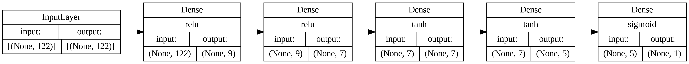
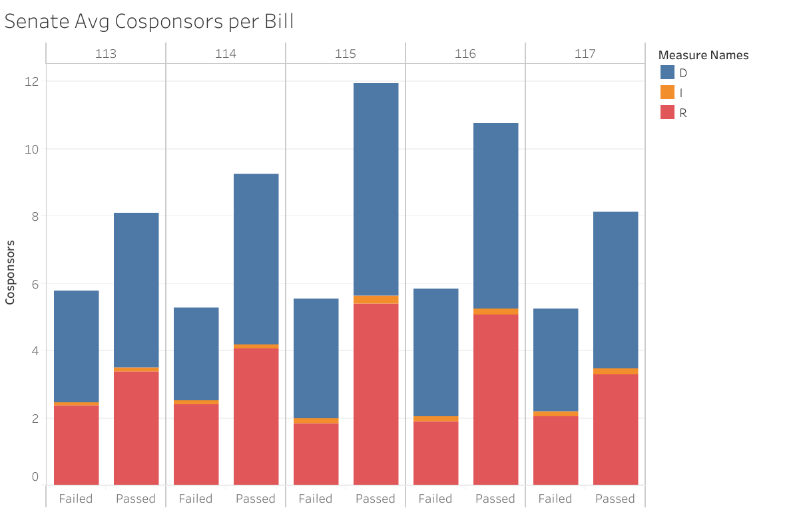
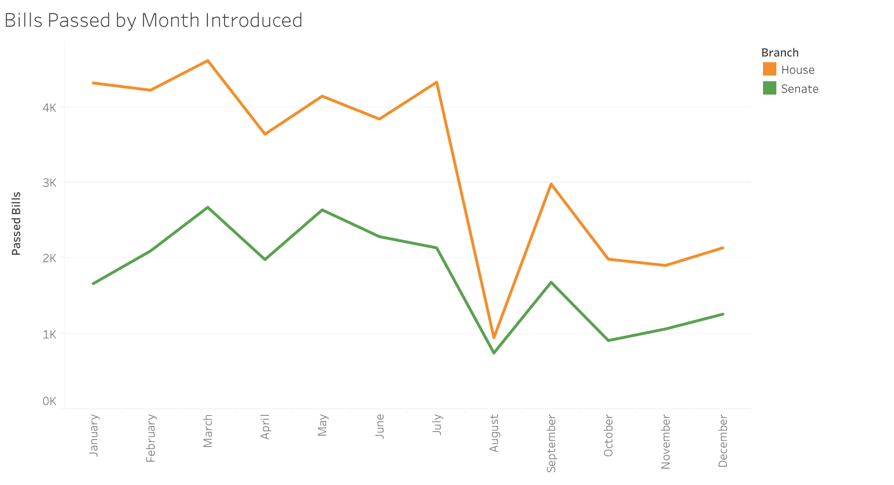

# US Bills Pass/Fail Predictions
Check out our website --> [US Bills App](https://usbillsapp.onrender.com/)

## Purpose

The purpose of this project is to create predictions of whether bills introduced in the US House of Representatives or US Senate would pass or fail based on machine learning of previous terms of Congress. Bill information would be taken from CSVs and web scraping, cleaned and formatted to fit a neural network model, and uploaded to a MongoDB database for storage. From there, the model would be trained, tested, and optimized for accuracy. Findings of trends and model results would be charted and displayed. Then a webpage application would be created to allow users to choose from a list of the Top 25 Most Popular Bills (according to GovTrack.us) to see the bill information and our prediction of the likelihood of the bill passing as it was written upon time of data collection. This website would also include additional pages to view information about the model and findings, as well as sortable data tables to view all bill information and a map to dispaly information relevenat to each state.
 
 

## Datasets and Tools Used

### Datasets:
- [Congress.gov](https://api.congress.gov/)
- [Pro Publica](https://www.propublica.org/datastore/api/propublica-congress-api)
- [GovTrack.us](https://www.govtrack.us/congress/bills/)

### Tools:
<ul>
<li>Python</li>
    <ul>
    <li>Pandas</li>
    <li>BeautifulSoup</li>
    <li>Flask</li>
    <li>TensorFlow and Keras</li>
    </ul>
<li>MongoDB</li>
<li>Tableau</li>
<li>HTML/CSS</li>
    <ul>
    <li>Bootstrap</li>
    </ul>
<li>JavaScript</li>
    <ul>
    <li>Leaflet</li>
    <li>D3</li>
    </ul>
<li>Render (hosting)</li>
</ul>
 
 

## Model

The models were built using neural network machine learning algorithms using scikit-learn and TensorFlow/Keras packages for Python. After data cleaning, the total training/testing dataset for all bills was 60,568. For training the respective models, the data was split into House data containing 39,055 bills and Senate data containing 21,126 bills.

After further preprocessing, the datasets were individually split into training and testing data, which were fit using the model description below, creating the House and Senate models.

- Target: Bill Passed into Law
- Features: Congress Term, Sponsor Party, Count of Cosponsors, Count of Cosponsors by party, Total # of Cosponsor States, Count of Cosponsors by state, Month Introduced, Subject (Total features: House model 122, Senate model 115)
- Total Layers: 5
- Activation Functions: relu, relu, tanh, tanh, sigmoid
- Neurons for each hidden layer: 9/7/7/5/1
- Epochs: 100
 
 

 
 
The house model attained an accuracy score of <strong>97.04%</strong>. The Senate model attained an accuracy score of <strong>95.76%</strong>.
 
 

## Additional Findings

House of Representatives             |  Senate
:-------------------------:|:-------------------------:
  |  
 
 
 
The number of bills passed for both chambers remained fairly consistent throughout, whereas the number of failed bills increased significantly over the last three iterations of Congress (115th, 116th, and 117th). With regard to average cosponsors, there are significant pattern differences between the two chambers. Passed bills in the house are showing a greater number of cosponsors attached in the 116th and 117th Congresses. Meanwhile, those same iterations of Congress are showing descreases in cosponsorships of passed bills in the Senate.
 
 
It was also discovered that bills introduced in the first half of the year had a higher rate of passing success than the second half of the year. For both chambers, bills introduced in August had the lowest success rate.

 
 

## Project Team

- [Zack Crowley](https://github.com/zwcrowley)
- [Sam Holland](https://github.com/holla394)
- [Jordan Jeranek](https://github.com/JJERANEK)
- [Lindsey Wolterstorff](https://github.com/LindseyWol)